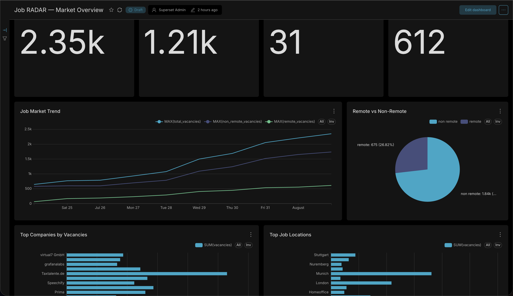

# Job RADAR

**Job RADAR** — портфельный Data Engineering проект для сбора, обработки, хранения и анализа данных о вакансиях.

Проект реализует полный multi-source pipeline:

```text
Job APIs
   ↓
Extraction
   ↓
Raw Storage
   ↓
Normalization
   ↓
Data Quality
   ↓
Multi-source Combination
   ↓
Deduplication
   ↓
ClickHouse
   ↓
Analytical Marts
   ↓
Apache Superset
```

Основной фокус — практический Data Engineering: ingestion из нескольких API, единая модель данных, raw/processed storage layers, data quality, orchestration, аналитические витрины и BI.

---

## Dashboard

Job RADAR включает dashboard в Apache Superset, построенный поверх аналитических витрин ClickHouse.

Текущие визуализации:

- Total Vacancies
- Unique Companies
- Detected Skills
- Remote Vacancies
- Job Market Trend
- Remote vs Non-Remote
- Top Companies by Vacancies
- Top Job Locations



Экспорт dashboard хранится в:

```text
bi/superset/exports/
```

---

## Текущий релиз

**v1.0.0 — released / portfolio-ready**

Первый стабильный релиз включает:

- 3 источника вакансий;
- raw и processed data layers;
- S3-compatible object storage;
- canonical job schema;
- data quality checks;
- объединение данных из нескольких источников;
- deterministic exact deduplication;
- ClickHouse;
- 7 аналитических marts;
- Airflow orchestration;
- Apache Superset dashboard;
- focused unit tests;
- публичную архитектурную и portfolio-документацию.

---

# Источники данных

Текущий pipeline работает с:

- **Arbeitnow**
- **RemoteOK**
- **Jooble**

Для каждого источника реализованы отдельные extractor и normalizer.

```text
API request
    ↓
Fail-fast response validation
    ↓
Save raw JSON
    ↓
Upload raw data to MinIO
    ↓
Build batch_id
    ↓
Normalize to canonical schema
    ↓
Quality checks
    ↓
Save processed CSV
    ↓
Upload processed data to MinIO
    ↓
Return pandas DataFrame
```

Source-specific логика остаётся изолированной, а downstream pipeline работает с общей схемой.

---

# Архитектура

```text
Arbeitnow ─┐
RemoteOK  ─┼─→ Extractors
Jooble    ─┘
              ↓
         Raw JSON
              ↓
         MinIO Raw
              ↓
    Source Normalization
              ↓
      Canonical Schema
              ↓
       Quality Checks
              ↓
     Processed CSV / MinIO
              ↓
   Normalized DataFrames
              ↓
 Combine Normalized Batches
              ↓
      Exact Deduplication
              ↓
      Schema Validation
              ↓
         ClickHouse
              ↓
      7 Analytical Marts
              ↓
      Apache Superset
```

Airflow orchestration:

```text
create_clickhouse_schema
          ↓
   run_jobs_pipeline
```

Подробно:

```text
docs/architecture.md
```

---

# Canonical Job Schema

```text
batch_id
source
source_job_id
title
company
location_raw
country
remote
url
tags
skills
created_at
extracted_at
description
```

Loader добавляет:

```text
loaded_at
```

Перед вставкой в ClickHouse canonical schema валидируется и приводится к ожидаемым типам.

---

# Storage Layers

Raw data:

```text
data/raw/
raw/source=<source>/dt=<YYYY-MM-DD>/
```

Processed data:

```text
data/processed/
processed/source=<source>/dt=<YYYY-MM-DD>/
```

Raw ответы сохраняются отдельно от нормализованных данных, чтобы исходные payloads можно было проверить или переработать повторно.

---

# Multi-source Processing

```python
normalized_batches = [
    run_arbeitnow(),
    run_remoteok(),
    run_jooble(),
]
```

Exact deduplication выполняется в два этапа:

```text
(source, source_job_id)
        ↓
normalized URL
```

Fuzzy/semantic deduplication осознанно не входит в scope v1.0.

---

# ClickHouse

Database:

```text
job_radar
```

Основная таблица:

```text
jobs
```

Loader:

```text
combined DataFrame
        ↓
add loaded_at
        ↓
schema validation / type casting
        ↓
insert_df()
        ↓
ClickHouse
```

Также остаётся CSV fallback mode для ручной диагностики или восстановления.

---

# Аналитические витрины

В проекте реализованы семь marts:

```text
skills_mart
remote_mart
companies_mart
locations_mart
skill_pairs_mart
daily_snapshot_mart
daily_country_mart
```

Они покрывают skill demand, remote-work аналитику, компании, локации, сочетания навыков, daily snapshots и country-level аналитику.

---

# Airflow

Текущий setup:

```text
Apache Airflow 2.9.3
LocalExecutor
PostgreSQL metadata database
```

DAG:

```text
job_radar_pipeline
```

Schedule:

```text
08:00 Europe/Podgorica
```

Operational settings:

```text
retries = 2
retry_delay = 2 minutes
max_active_runs = 1
catchup = False
```

Airflow используется как orchestration layer, а business logic остаётся в обычных Python-модулях.

---

# Тесты

Focused unit tests покрывают ключевую deterministic-логику:

- URL normalization;
- tracking-parameter removal;
- deterministic fallback `source_job_id`;
- country normalization;
- `batch_id`;
- объединение DataFrame'ов;
- обработку пустых batches;
- exact source-level deduplication;
- exact cross-source URL deduplication.

Запуск:

```bash
uv run pytest -q
```

Текущий результат:

```text
11 passed
```

---

# Tech Stack

- Python 3.12
- pandas
- requests
- python-dotenv
- boto3
- clickhouse-connect
- Docker / Docker Compose
- MinIO
- ClickHouse
- Apache Airflow 2.9.3
- PostgreSQL
- LocalExecutor
- Apache Superset
- pytest
- uv
- Git / GitHub

---

# Структура проекта

```text
de_job_radar/
│
├── airflow/
│   └── dags/
│       └── job_radar_pipeline_dag.py
├── bi/
│   └── superset/
│       ├── README.md
│       └── exports/
├── docs/
│   ├── architecture.md
│   ├── roadmap.md
│   ├── PORTFOLIO.md
│   ├── images/
│   │   └── job_radar_market_overview.png
│   └── checkpoints/
│       └── 2026-08-02_v1.0.0_release.md
├── sql/
│   ├── basic_analysis.sql
│   └── clickhouse/
│       ├── create_tables/
│       └── refresh_marts/
├── src/
│   ├── extractors/
│   ├── normalizers/
│   ├── loaders/
│   ├── pipelines/
│   └── utils/
├── tests/
│   ├── conftest.py
│   ├── test_common.py
│   ├── test_combine_normalized_batches.py
│   └── test_s3.py
├── Dockerfile.airflow
├── docker-compose.yml
├── docker-compose.airflow.yml
├── requirements.txt
├── .env.example
├── README.md
└── README_RU.md
```

---

# Запуск проекта

## 1. Создать окружение

```bash
uv venv
uv pip install -r requirements.txt
```

## 2. Настроить environment variables

```bash
cp .env.example .env
```

Заполнить API и infrastructure credentials. `.env` не коммитить.

## 3. Запустить MinIO и ClickHouse

```bash
docker compose up -d
docker compose ps
```

## 4. Создать ClickHouse schema

```bash
uv run python -m src.loaders.create_clickhouse_schema
```

## 5. Запустить полный pipeline

```bash
uv run python -m src.pipelines.run_jobs_pipeline
```

## 6. Запустить отдельный источник

```bash
uv run python -m src.extractors.e_arbeitnow
uv run python -m src.extractors.e_remoteok
uv run python -m src.extractors.e_jooble
```

## 7. Запустить тесты

```bash
uv run pytest -q
```

## 8. Запустить Airflow

```bash
docker compose -f docker-compose.airflow.yml up -d
```

Airflow UI:

```text
http://localhost:8080
```

## 9. Dashboard

Superset local UI:

```text
http://localhost:8088
```

---

# Data Quality

Текущие проверки:

- fail-fast validation API responses;
- missing title;
- missing URL;
- duplicate URL;
- jobs without skills;
- required-field filtering;
- canonical schema validation;
- type casting;
- exact multi-source deduplication.

---

# Design Principles

Job RADAR намеренно избегает лишней архитектурной сложности.

- независимые source modules;
- единая canonical schema;
- source-specific normalization изолирована;
- SQL analytics остаётся в SQL;
- ClickHouse marts обслуживают BI;
- Airflow orchestrates, но не содержит business logic;
- deterministic exact deduplication идёт раньше fuzzy matching;
- infrastructure воспроизводится через Docker;
- новые технологии добавляются только при понятной инженерной ценности.

В v1 намеренно не используются extractor factories, большие inheritance hierarchies, Kafka, Spark, Kubernetes и microservices.

---

# Документация

- [Architecture](docs/architecture.md)
- [Portfolio Overview](docs/PORTFOLIO.md)
- [Roadmap](docs/roadmap.md)
- [v1.0.0 Release Checkpoint](docs/checkpoints/2026-08-02_v1.0.0_release.md)

---

# Статус

```text
v1.0.0
RELEASED
PORTFOLIO-READY
```

Первый стабильный релиз Job RADAR завершён, tagged и published.

Дальнейшая разработка начинается с post-v1 roadmap, а не с незавершённого MVP.
